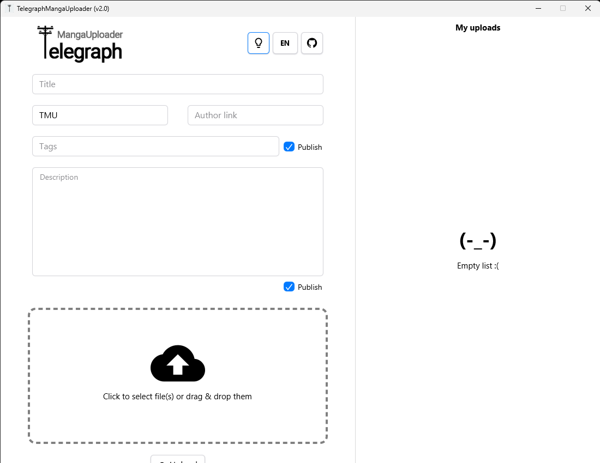
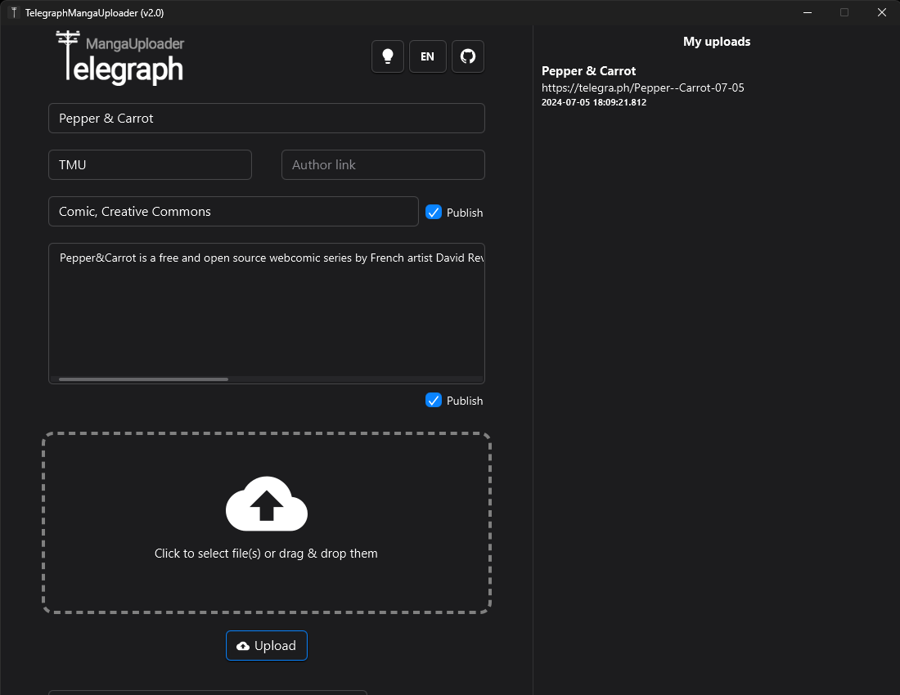

<p align="center">
  
</p>

**TMU** (TelegraphMangaUploader) is very simple app for posting your digital manga (or any other image batch) as article into **Telegraph** for further reading using any browser or in **Telegram** with **Instant View**.

App may be very helpful for content translators that searching easy way to share their work.

## Features:
- Very simple with clean UI
- No Ads
- Ability to set Title, Tags and Description for article
- Upload batch of images or images from archive(s)
- Read metadata info from **book_info.json** metadata file and autofill **Tags/Description** fields
- Uploads history
- Ability to copy prepared post for **Telegram** after posting to **Telegraph**
- Support of **zip, rar, 7z, cbz, cbr, cb7** archives when running in **JVM** mode (from *.jar file)
- Support of **zip, cbz** archives when running in **Native Image** mode (from native executable file)

## Images:
<p align="center">
    
    
    
    
</p>

## Download:
Navigate to Releases section and download latest version of app

## Building:
You will need [IntelliJ IDEA](https://www.jetbrains.com/) and [GraalVM 17](https://www.graalvm.org/downloads/) (**Java 17**)

Clone repository and open project root folder. Create file `gradle.properties` with content:
```
GRAALVM_WINDOWS_HOME = {path}
GRAALVM_LINUX_HOME = {path}
GRAALVM_MACOSX_HOME = {path}
```
where `{path}` - path to `GraalVM` folder. Then open project with `IDEA`

### Building GraalVM Native Image executable:
**WARNING:** *you need at least 10GB of RAM to build native image! Native Build uses up to 8GB of RAM per build!*

Follow [this guide](https://www.graalvm.org/reference-manual/native-image/) and install all dependencies for GraalVM to enable Native Image support.

**WARNING:** *when installing VS Code build tools select English language for ALL packages that will be installed!*

In **IDEA** navigate to `File` > `Setting` > `Tools` > `Terminal` > `Shell path`, clear this field and paste new path (change Visual Studio path if it's different): `cmd.exe /k "C:\Program Files (x86)\Microsoft Visual Studio\2019\Community\VC\Auxiliary\Build\vcvars64.bat`. Hit `OK`

In **IDEA** on bottom bar click `Terminal`. If you see `[vcvarsall.bat] Environment initialized for: 'x{86 or 64}'` message, then all being setup correctly

Just type `gradlew nativeBuild nativeRun` in that Terminal session, hit Enter and wait build finish. On `Ryzen 3600X` from HDD it takes around 2-3 minutes to finish

Build will finish with app launch. Navigate to `{projectDir}\build\client\x86_64-windows` on `Windows` or `{projectDir}/build/client/x86_64-linux` on `Linux` to find executable files.

On `Windows` it will be `TelegraphMangaUploader.exe`.
On `Linux` it will be `TelegraphMangaUploader`

### Building JVM jar file:
You also need [JavaFX 22 jmods](https://gluonhq.com/products/javafx//) runtime files places anywhere on your system

Simply execute `shadowJar` task

Result fat jar you can run using this command (replace variables with curly brackets to your own:
```
{path_to_java_exe_from_jvm_sdk} --module-path={path_to_jfx_jmods_folder} --add-modules=javafx.base,javafx.controls,javafx.fxml,javafx.graphics --add-opens javafx.graphics/javafx.css=ALL-UNNAMED --add-opens javafx.graphics/com.sun.javafx.css=ALL-UNNAMED --add-opens javafx.controls/javafx.scene.control.skin=ALL-UNNAMED --add-opens java.base/java.lang.reflect=ALL-UNNAMED --add-opens java.base/sun.nio.ch=ALL-UNNAMED --add-opens java.base/java.io=ALL-UNNAMED --add-exports javafx.base/com.sun.javafx.event=ALL-UNNAMED --add-exports javafx.controls/com.sun.javafx.scene.control.behavior=ALL-UNNAMED --add-exports javafx.controls/com.sun.javafx.scene.control.inputmap=ALL-UNNAMED --add-exports javafx.graphics/com.sun.javafx.scene.traversal=ALL-UNNAMED --add-exports javafx.controls/com.sun.javafx.scene.control=ALL-UNNAMED --add-exports javafx.base/com.sun.javafx.binding=ALL-UNNAMED --add-exports javafx.graphics/com.sun.javafx.stage=ALL-UNNAMED --add-exports javafx.base/com.sun.javafx.event=ALL-UNNAMED --add-exports javafx.base/com.sun.javafx.event=ALL-UNNAMED --add-exports javafx.graphics/com.sun.javafx.scene=ALL-UNNAMED --add-exports javafx.graphics/com.sun.javafx.scene.traversal=ALL-UNNAMED --add-exports javafx.controls/com.sun.javafx.scene.control.behavior=ALL-UNNAMED --add-exports javafx.controls/com.sun.javafx.scene.control=ALL-UNNAMED --add-exports javafx.controls/com.sun.javafx.scene.control.inputmap=ALL-UNNAMED --add-exports javafx.base/com.sun.javafx.event=ALL-UNNAMED --add-exports javafx.base/com.sun.javafx.collections=ALL-UNNAMED --add-exports javafx.base/com.sun.javafx.runtime=ALL-UNNAMED --add-opens javafx.controls/javafx.scene.control.skin=ALL-UNNAMED --add-opens javafx.graphics/javafx.scene=ALL-UNNAMED --add-opens=javafx.graphics/com.sun.javafx.text=ALL-UNNAMED --add-opens=javafx.graphics/javafx.scene.text=ALL-UNNAMED --add-exports javafx.graphics/com.sun.javafx.scene.text=ALL-UNNAMED --add-exports javafx.graphics/com.sun.javafx.geom=ALL-UNNAMED -jar {path_to_jar}
```


